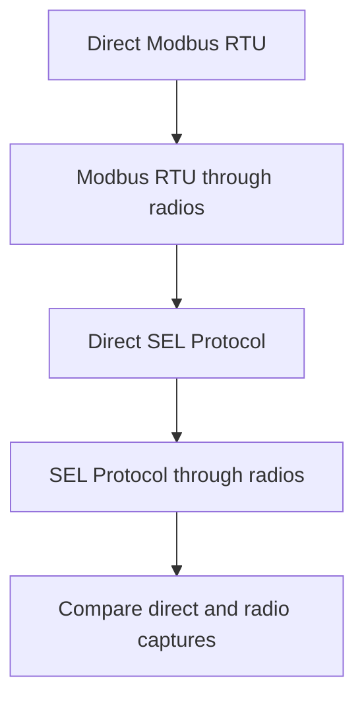

# Wireless Relay Communication Integration

**SEL-3555 RTAC <-> Phoenix Contact RAD-900-IFS <-> SEL-751 Feeder Protection Relay**

A controlled industrial communication experiment that evaluates a wireless serial path between an SEL-3555 Real-Time Automation Controller and an SEL-751 feeder protection relay using two Phoenix Contact RAD-900-IFS 900 MHz radios.

The project used direct baselines, Modbus RTU, SEL Protocol, EIA-232/EIA-485 trials, DTE/DCE analysis, electrical measurements, and RTAC communication captures to separate physical-layer problems from framing, timeout, and application-session behavior.

> **Engineering status:** Modbus RTU communication through the radio pair was fully proven. Direct SEL Protocol was proven. Readable bidirectional SEL traffic was also proven through the radios, while final RTAC SEL-client application acceptance remains open.

---

## Project at a Glance

| Test | Result | What it proves |
|---|---|---|
| Direct Modbus RTU | PASS | RTAC polling and SEL-751 Modbus configuration work without radios |
| Modbus RTU through radios | PASS | RF link, wiring, framing, and request/response transport work end to end |
| Direct SEL Protocol | PASS | RTAC SEL client and relay-native protocol work directly |
| SEL traffic through radios | PASS - transport layer | Readable SEL-751 responses return through the radio pair |
| RTAC SEL client online state through radios | OPEN | Final application session is not yet accepted consistently |
| Automatic recovery after radio power cycle | PENDING | Must be tested after stable online operation is achieved |

---

## Why This Project Matters

A flashing transmit or receive LED does not prove that an industrial protocol is working. It only proves that some bytes are moving.

The complete system contained four serial endpoints:

1. SEL-3555 RTAC
2. Master RAD-900-IFS radio
3. Remote RAD-900-IFS radio
4. SEL-751 relay

Every endpoint had to agree on interface type, baud rate, data bits, parity, stop bits, flow control, signal direction, and protocol behavior. The radios also introduced additional timing and packet-boundary effects that do not exist in a direct cable connection.

The project was therefore designed to answer a more useful engineering question:

> At which layer does communication stop being valid?

---

## System Architecture


### Request and Response Path

```text
RTAC request
    -> master-radio RX
    -> wireless link
    -> remote-radio TX
    -> SEL-751 RX
    -> SEL-751 response
    -> remote-radio RX
    -> wireless link
    -> master-radio TX
    -> RTAC RX
```

The Phoenix radios operate as transparent serial transport devices. They do not interpret Modbus RTU or SEL Protocol; they move serial bytes between their local interfaces.

---

## Engineering Objectives

- Build a point-to-point wireless serial link between the RTAC and relay.
- Establish a known-good direct baseline before adding radios.
- Validate Modbus RTU and SEL Protocol independently.
- Determine the correct interface type and signal wiring.
- Distinguish physical-layer faults from framing and application-session faults.
- Create a repeatable commissioning and troubleshooting process.
- Document proven results and unresolved items without overclaiming completion.

---

## Hardware and Software

### Hardware

- SEL-3555 RTAC
- SEL-751 feeder protection relay
- 2 x Phoenix Contact RAD-900-IFS radios
- 24 Vdc bench power supplies
- EIA-232 serial cabling and DB9 breakout wiring
- SEL-2886 EIA-232/EIA-485 converter used during alternate trials

### Software

- SEL ACSELERATOR RTAC
- SEL ACSELERATOR QuickSet
- Phoenix Contact PSI-CONF

---

## Final EIA-232 Wiring

The final radio path used a three-wire EIA-232 connection at both ends.

| End-device signal | Typical DB9 pin in the bench test | RAD-900-IFS terminal | Function |
|---|---:|---:|---|
| Device TX | 3 | 5.1 | Data from the RTAC or SEL-751 into radio RX |
| Device RX | 2 | 5.2 | Data from radio TX into the RTAC or SEL-751 |
| Signal ground | 5 | 5.3 | Common EIA-232 signal reference |

### Signal Rule

```text
Device TX -> Radio RX 5.1
Radio TX 5.2 -> Device RX
Device GND -> Radio GND 5.3
```

### DTE / DCE Interpretation

The RAD-900-IFS interface is identified as DCE. Cable names such as "straight-through" or "crossover" are not enough when screw terminals and vendor-specific cables are involved. The connection was verified by signal direction, continuity, and voltage.

### Verification Method

- De-energize before continuity tests or conductor changes.
- Confirm DB9 orientation from the connector face; the rear view is mirrored.
- Identify conductors by continuity and label them TX, RX, and GND.
- Do not trust conductor color alone.
- After energization, verify a negative EIA-232 idle voltage from device TX to signal ground.
- Disable RTS/CTS and XON/XOFF for the three-wire path.

---

## Configuration Baselines

The project used two separate, intentionally preserved configurations.

### Modbus RTU Working Baseline

| Item | Working value |
|---|---|
| SEL-751 Port 3 protocol | MOD |
| Serial format | 9600 baud, 8 data bits, no parity, 2 stop bits |
| Relay slave address | 1 |
| RTAC operation | Read holding register |
| Test register | Zero-based address 0, quantity 1 |
| Test value | First mapped relay current value |
| Radio result | Valid responses; RTAC `Offline = FALSE` |

### Final SEL Protocol Test Baseline

| Component | Interface / protocol | Serial format | Other settings |
|---|---|---|---|
| SEL-3555 RTAC COM1 | EIA-232 / SEL client | 9600, 8-N-1 | RTS/CTS off, XON/XOFF off |
| RAD-900-IFS master | RS-232 / wireless master | 9600, 8-N-1 | No flow control |
| RAD-900-IFS remote | Wireless remote / RS-232 | 9600, 8-N-1 | No flow control |
| SEL-751 Port 3 | EIA-232 / SEL Protocol | 9600, 8-N-1 | RTS/CTS off; maximum access level 2 |

> The Modbus and SEL configurations use different stop-bit settings. They must be stored as separate test baselines, not mixed together.

### RTAC SEL Client Test Values

| Setting | Test value |
|---|---|
| Physical port | COM1 |
| Port type | EIA232 |
| Serial format | 9600 / 8 / None / 1 |
| RTS/CTS | False |
| XON/XOFF | False |
| ASCII inactivity timeout | 8000 ms test value |
| Binary inactivity timeout | 3000 ms test value |
| Event / COMTRADE collection | Disabled during first connection tests |

---

## Controlled Test Strategy

The troubleshooting sequence was designed to isolate one layer at a time.



### Why Modbus Was Tested First

Modbus RTU has a simple and visible request/response structure. A successful Modbus transaction through the radios proved that:

- both radios were powered and linked;
- the RF path could carry data;
- local serial interfaces were functioning;
- command traffic reached the relay;
- relay responses returned to the RTAC;
- the basic three-wire path was valid.

This prevented later SEL Protocol troubleshooting from being incorrectly blamed on the radio hardware or basic wiring.

---

## Evidence-Based Diagnostics

### LED Interpretation

| LED direction | Engineering interpretation |
|---|---|
| Master RX and remote TX | Command is travelling from RTAC toward relay |
| Remote RX and master TX | Response is travelling from relay toward RTAC |

LEDs are useful direction indicators, but protocol captures are required to prove a valid response.

### RTAC Communication Monitor

The RTAC Comm Monitor was used to distinguish:

- no transmission;
- outgoing requests with no return path;
- framing errors;
- echoed requests;
- readable relay responses;
- application-driver rejection despite readable data.

---

## Troubleshooting Findings

| Observed symptom | Interpretation | Corrective direction |
|---|---|---|
| Comm Monitor blank | Client not transmitting, project not downloaded, wrong device selected, or COM-port conflict | Verify active project, port ownership, download, and online state |
| `DATA_TX` present but master-radio RX inactive | Software transmits, but signal does not reach radio RX | Verify EIA-232 mode, physical port, and TX-to-5.1 wiring |
| `FRAMING_ERROR` | Baud, data, parity, stop-bit mismatch, or corrupted timing | Match all four endpoints exactly |
| Request returned exactly as transmitted | Local echo, converter echo, or incorrect interface behavior | Disable echo and prove response origin |
| Master RX and remote TX only | Request reaches relay side but response does not return | Verify SEL-751 TX to remote-radio 5.1 and signal ground |
| Readable SEL-751 text returned | Physical and serial transport are functioning | Stop rewiring; investigate session, access sequence, and timeouts |
| `Offline = TRUE` with readable data | RTAC driver rejects or times out on the full session | Compare direct and radio captures byte for byte |

---

## Root-Cause Lessons

### 1. Stop-Bit Mismatch Caused Framing Errors

The early SEL test retained the two-stop-bit Modbus configuration while the relay SEL port used one stop bit. Aligning the complete path to 9600 / 8 / None / 1 removed the basic framing mismatch.

### 2. Cable Type Must Be Proven by Signals

The radio is DCE, while the RTAC and relay interfaces behave as end devices. A normal computer cable and an SEL crossover cable are not interchangeable. Wiring was validated by TX/RX direction and voltage, not connector appearance or cable name.

### 3. Continuity Is Necessary but Not Sufficient

Continuity proved that a conductor was connected from one end to the other. It did not prove that TX reached the correct RX input or that valid EIA-232 data was present.

### 4. Readable Traffic Changes the Troubleshooting Layer

Once readable SEL-751 data reached RTAC RX, repeated wire swapping was no longer justified. The fault domain moved from the physical layer to timing, packet boundaries, access sequencing, auto-configuration, or driver acceptance.

### 5. Preserve Known-Good Projects

The working Modbus configuration and SEL Protocol configuration were stored separately. A single physical COM port must not be owned by two active protocol clients at the same time.

---

## Results

### What Is Proven

- RTAC COM1 transmits EIA-232 data.
- The master radio receives RTAC requests.
- The wireless link delivers requests to the remote radio.
- The SEL-751 receives and processes serial commands.
- The relay generates readable responses.
- Responses return through both radios to RTAC RX.
- Modbus RTU remains online through the radio pair.
- Direct SEL Protocol works without the radios.
- The final SEL radio path uses matched 9600 / 8 / None / 1 framing.

### Remaining Open Item

The RTAC SEL client still indicated `Offline = TRUE` through the radio path even when readable SEL-751 text returned.

Because the same client worked directly, the remaining cause is most likely within one or more of these areas:

- response timing;
- command/response boundary changes;
- carriage-return or line-feed handling;
- password/access sequence behavior;
- auto-configuration state;
- radio packetization;
- RTAC inactivity timeout behavior.

This project therefore claims **proven bidirectional transport**, not final SEL application acceptance.

---

## Required Next Diagnostic Test

1. Capture the complete direct SEL session from client startup until `Offline = FALSE`.
2. Capture the radio-path session over the same interval using identical RTAC and relay settings.
3. Compare:
   - command order;
   - response text;
   - response delay;
   - missing, duplicated, or grouped bytes;
   - carriage-return and line-feed boundaries.
4. If the radio capture is byte-complete, investigate access/password monitoring and auto-configuration outputs.
5. If the response is delayed or grouped differently, tune radio frame-end timing and RTAC inactivity timeouts.
6. Escalate both captures to SEL technical support if the protocol driver still rejects the session.

> Do not change the proven final wiring unless new evidence shows a physical-layer fault.

---

## Final Commissioning Checklist

| Step | Required action | Evidence |
|---|---|---|
| Hardware | Confirm 24 Vdc power and antennas installed before transmission | Power and link LEDs |
| Port ownership | Disconnect QuickSet and disable other RTAC clients using COM1 | One active owner |
| Relay | Read Port 3 from the physical SEL-751 | QuickSet readback |
| RTAC | Set COM1 to EIA-232, 9600, 8-N-1, no flow control | RTAC settings |
| Radios | Configure both radios for RS-232, 9600, 8-N-1, no handshake | PSI-CONF readback |
| Wiring | TX -> 5.1, 5.2 -> RX, GND -> 5.3 at both ends | Continuity and voltage |
| Download | Build with zero errors and download to RTAC | Build output |
| Monitor | Capture both transmitted and received readable data | Comm Monitor |
| Application | Confirm `Offline = FALSE` and stable tag updates | Controller online view |
| Recovery | Power cycle the radios and verify automatic recovery | Timed recovery test |
| Handover | Archive projects, settings, captures, drawing, and sign-off | Handover package |

---

## Suggested Repository Structure

```text
sel751-rtac-rad900/
|- README.md
|- docs/
|  |- SEL751_RTAC_RAD900_Project_Report.pdf
|  `- commissioning-checklist.md
|- diagrams/
|  |- wireless-architecture.png
|  |- eia232-wiring.png
|  `- troubleshooting-flow.png
|- images/
|  |- complete-bench.jpg
|  |- radio-nameplate.jpg
|  |- modbus-over-radio-proof.png
|  |- direct-sel-proof.png
|  `- sel-radio-comm-monitor.png
|- examples/
|  |- sanitized-settings-sheet.md
|  `- test-matrix.csv
`- LICENSE
```

---

## Evidence to Include in the Repository

The most valuable public evidence is:

1. Complete system architecture
2. Labelled bench photograph
3. Final signal-based EIA-232 wiring diagram
4. PSI-CONF serial settings for both radios
5. SEL-751 Port 3 QuickSet readback
6. Working direct Modbus capture
7. Working Modbus-over-radio result showing online state
8. Working direct SEL capture
9. Radio-path Comm Monitor capture with readable TX and RX data
10. Test matrix separating physical, transport, and application acceptance

All screenshots should be sanitized before publication.

---

## Safety and Cybersecurity

- De-energize wiring before continuity tests or conductor changes.
- Install antennas before enabling radio transmission and follow site RF requirements.
- Replace temporary exposed conductors with labelled, ferruled, strain-relieved wiring for permanent installation.
- Use shielded industrial cable and approved grounding practices.
- Do not publish relay passwords, plant IP addresses, live credentials, or unapproved configuration exports.
- Wireless encryption does not replace segmentation, access control, secure engineering workstations, or change management.
- Monitoring and remote control must be treated as separate scopes. Remote commands require hazard analysis, interlock verification, and formal approval.

---

## What This Project Demonstrates

- Industrial wireless communication integration
- SEL RTAC and protection-relay configuration
- Modbus RTU and SEL Protocol testing
- EIA-232 and EIA-485 interface analysis
- DTE/DCE and TX/RX signal interpretation
- Serial framing and timeout troubleshooting
- Electrical continuity and voltage verification
- Protocol capture analysis
- Layered fault isolation
- Commissioning and handover documentation
- Honest engineering status reporting

---

## Current Status and Future Work

### Completed / Demonstrated

- Direct Modbus RTU baseline
- Modbus RTU through the 900 MHz radio pair
- Direct SEL Protocol baseline
- Bidirectional readable SEL transport through the radio pair
- Final EIA-232 signal map
- Matched 9600 / 8-N-1 SEL framing
- Structured troubleshooting and commissioning record

### Future Work

- Complete direct-versus-radio byte-level capture comparison
- Tune radio frame-end or idle timing if required
- Tune RTAC inactivity timeouts based on evidence
- Confirm stable `Offline = FALSE` operation
- Perform repeated communication and power-cycle recovery tests
- Produce final ferruled and labelled as-built wiring
- Complete commissioning sign-off

---

## Documentation

See the `docs/` directory for the full engineering project report, test evidence, commissioning sequence, and open-item record.

---

## Author

**Naman Arora**  
Electrical Engineering | Protection and Control | Industrial Communications | OT Integration

---

## Disclaimer

This repository is an educational and portfolio representation of an industrial bench-test project. It is not a substitute for manufacturer documentation, RF requirements, electrical-safety procedures, approved relay settings, or site commissioning standards. Product names and trademarks belong to their respective owners.
